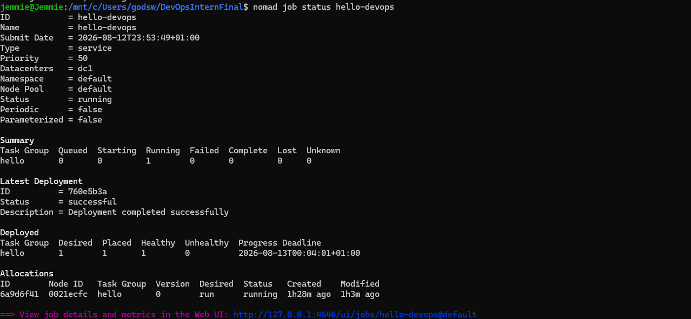
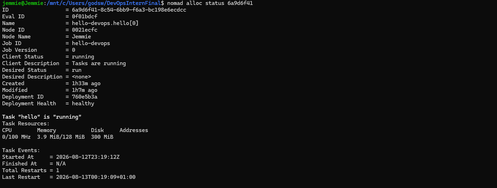
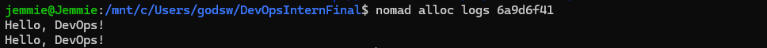
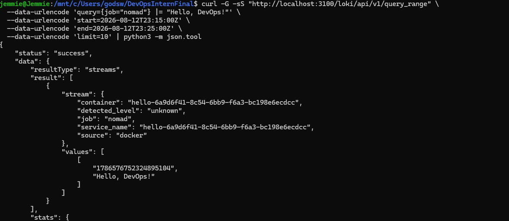

# DevOps Intern Final Assessment

## Project Overview

This project demonstrates an end-to-end DevOps workflow for a Python application using **Linux/Ubuntu, Bash, Git/GitHub, Docker, GitHub Actions, HashiCorp Nomad, Grafana Alloy, and Grafana Loki**.

The project covers application development, containerization, continuous integration, workload orchestration, and centralized log monitoring.

---

## Project Structure

```text
DevOpsInternFinal/
├── .github/
│   └── workflows/
│       └── ci.yml
├── evidence/
│   ├── loki-verification.png
│   ├── nomad-allocation-status.png
│   ├── nomad-application-logs.png
│   └── nomad-job-status.png
├── monitoring/
│   ├── alloy-config.alloy
│   └── loki_setup.txt
├── nomad/
│   └── hello.nomad
├── scripts/
│   └── sysinfo.sh
├── Dockerfile
├── hello.py
└── README.md
```

---

## Architecture

```text
Python Application
        ↓
      Docker
        ↓
 Local Registry
        ↓
HashiCorp Nomad
        ↓
 Grafana Alloy
        ↓
 Grafana Loki
        ↓
 Hello, DevOps!
```

---

## Task 1: Linux & Bash

The project was developed using **Ubuntu on Windows Subsystem for Linux (WSL)**.

System information script:

```bash
chmod +x scripts/sysinfo.sh
./scripts/sysinfo.sh
```

Python syntax verification:

```bash
python3 -m py_compile hello.py
```

**Result:** ✅ Linux environment and Bash script successfully verified.

---

## Task 2: Git & GitHub

Git and GitHub were used for source control and repository management.

```bash
git status
git add .
git commit -m "Complete Grafana Loki and Alloy monitoring setup"
git push origin main
```

**Result:** ✅ Project successfully version-controlled and pushed to GitHub.

---

## Task 3: Python Application

The application is defined in `hello.py`:

```python
import time

print("Hello, DevOps!", flush=True)

while True:
    time.sleep(60)
```

Application output:

```text
Hello, DevOps!
```

The application remains active so it can run as a Nomad workload and generate container logs for monitoring.

**Result:** ✅ Python application successfully created and validated.

---

## Task 4: Docker Containerization

The application was containerized and made available through a local Docker registry.

Build the image:

```bash
docker build -t devops-hello:latest .
```

Tag and push:

```bash
docker tag devops-hello:latest localhost:5000/devops-hello:latest
docker push localhost:5000/devops-hello:latest
```

Verify:

```bash
docker images devops-hello
docker ps
```

Nomad uses:

```text
localhost:5000/devops-hello:latest
```

**Result:** ✅ Docker image successfully built and made available for Nomad deployment.

---

## Task 5: GitHub Actions CI

The CI workflow is stored in:

```text
.github/workflows/ci.yml
```

The workflow runs on pushes to `main` and validates the Python application using:

```bash
python -m py_compile hello.py
```

Syntax validation is used because the application is designed to remain running continuously.

**Result:** 🟢 GitHub Actions completed successfully with a **GREEN / SUCCESS** status.

---

## Task 6: HashiCorp Nomad

The Dockerized application was deployed as a long-running Nomad workload.

Nomad job:

```text
nomad/hello.nomad
```

Validate and deploy:

```bash
nomad job validate nomad/hello.nomad
nomad job run nomad/hello.nomad
nomad job status hello-devops
```

Final verified state:

```text
Type      = service
Status    = running
Running   = 1
Failed    = 0
Healthy   = 1
Unhealthy = 0
```

Allocation verification:

```bash
nomad alloc status <allocation-id>
```

Verified allocation state:

```text
Client Status      = running
Client Description = Tasks are running
Deployment Health  = healthy
Task "hello"        = running
```

Application logs:

```bash
nomad alloc logs <allocation-id>
```

Output:

```text
Hello, DevOps!
```

### Deployment Evidence

**Nomad Job Status**



**Nomad Allocation Status**



**Nomad Application Logs**



**Result:** 🟢 Application successfully deployed as a healthy Nomad-managed Docker workload.

---

## Task 7: Grafana Alloy & Loki Monitoring

Monitoring configuration:

```text
monitoring/
├── alloy-config.alloy
└── loki_setup.txt
```

### Loki Verification

Check Loki readiness:

```bash
curl -sS http://localhost:3100/ready
```

Result:

```text
ready
```

### Alloy Verification

Grafana Alloy was configured to discover the `hello-*` Docker container, collect its logs, apply:

```text
job="nomad"
source="docker"
```

and forward the logs to Grafana Loki.

Validate the Alloy configuration:

```bash
docker run --rm \
  -v /mnt/c/Users/godsw/DevOpsInternFinal/monitoring/alloy-config.alloy:/etc/alloy/config.alloy:ro \
  grafana/alloy:latest \
  validate /etc/alloy/config.alloy
```

The configuration validated successfully without errors.

### End-to-End Log Verification

The application log was queried directly from Loki:

```bash
curl -G -sS "http://localhost:3100/loki/api/v1/query_range" \
  --data-urlencode 'query={job="nomad"} |= "Hello, DevOps!"' \
  --data-urlencode 'start=2026-08-12T23:15:00Z' \
  --data-urlencode 'end=2026-08-12T23:25:00Z' \
  --data-urlencode 'limit=10' | python3 -m json.tool
```

Successful response included:

```text
"status": "success"
"job": "nomad"
"source": "docker"
"Hello, DevOps!"
```

### Monitoring Evidence

**Loki Log Verification**



**Result:** 🟢 Complete monitoring pipeline successfully verified:

```text
Python → Docker/Nomad → Grafana Alloy → Grafana Loki → Hello, DevOps!
```

---

## Final Verification

| Component | Status |
|---|---|
| Linux / Bash | ✅ Complete |
| Git & GitHub | ✅ Complete |
| Python Application | ✅ Verified |
| Docker | ✅ Complete |
| Local Registry | ✅ Working |
| GitHub Actions CI | 🟢 Success |
| Nomad Deployment | 🟢 Healthy |
| Nomad Application Logs | 🟢 `Hello, DevOps!` |
| Grafana Alloy | 🟢 Running |
| Grafana Loki | 🟢 Ready |
| Alloy → Loki | 🟢 Verified |
| Loki Log Query | 🟢 `Hello, DevOps!` |

---

## Conclusion

This assessment successfully demonstrates an end-to-end DevOps workflow covering **Linux, Bash, Git/GitHub, Python, Docker, GitHub Actions CI, HashiCorp Nomad orchestration, Grafana Alloy log collection, and Grafana Loki log aggregation**.

The final verified pipeline is:

```text
Git/GitHub → GitHub Actions → Docker → Nomad → Grafana Alloy → Grafana Loki
```

The successful Loki query returning **`Hello, DevOps!`** confirms that the application was deployed and its logs were successfully collected, forwarded, and queried through the monitoring pipeline.